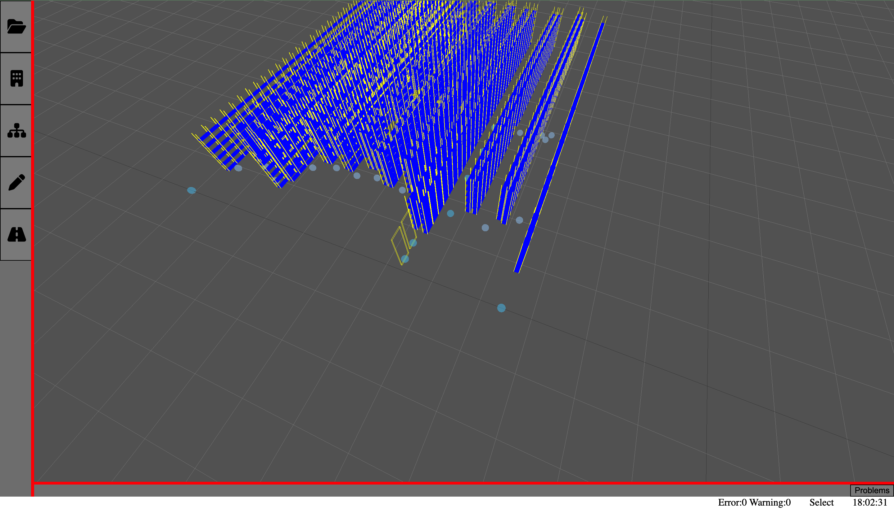

# OptimaDrawApp

This applet aims to provide user enough tools to model a warehouse. We currently support simple objects such as racks, rows, corridors. To assign a address to a rack
a `AddressingSphere` must be used and it must parent the object to be addressed. After the modelling is completed you can export your model which results in the output of a `JSON` file.

<p align="center">
    
</p>


## How to Get the Dev Server Up and Running ?

It is to noone's surprise that the default commands for any JS project applies to this project as well.
Which means

```bash
npm install
npm run dev
```
